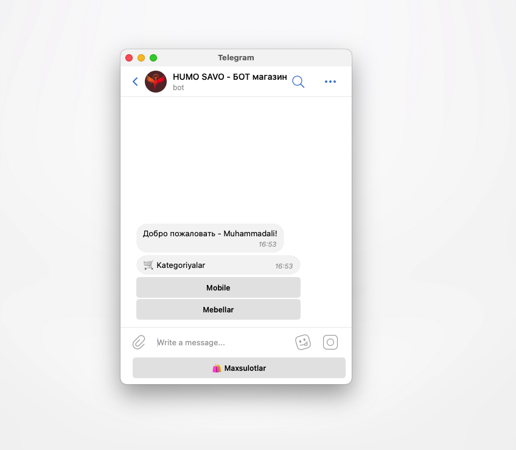

<!DOCTYPE html>
<html lang="en">
<head>
<meta charset="UTF-8">
<meta name="viewport" content="width=device-width, initial-scale=1.0">
<title>Telegram Bot</title>

</head>
<body>

  

  

  

  

 
FastApi Aiogram3 PostgreSQL SQLAlchemy

  

</body>
</html>
