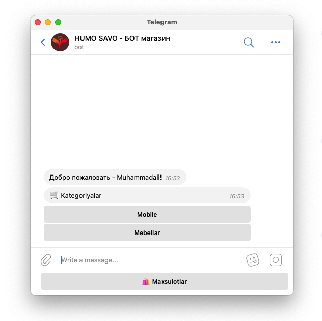

# Humo shop telegram bot

<div align="center" class="icon">
  
   
   
    </br>
   FastApi Aiogram3 PostgreSQL SQLAlchemy
</div>
</br>
<p align="center">
  
</p>

# Installation
* 1 - clone repo 
   - ```git clone git@github.com:Muhammadali-Akbarov/humo_bot.git```
* 2 - create a virtual environment and activate
  - ```pip3 install virtualenv```
  - ```virtualenv venv```
  - ```source venv/bin/activate```
* 3 - cd into project "cd humo_bot"
* 4 - Install dependencies
  - ```pip3 install -r requirements.txt```
* 5 - Set your environment variables
  - ```cp .env-sample .env```
* 6 - Run
  - ```python3 main.py```
